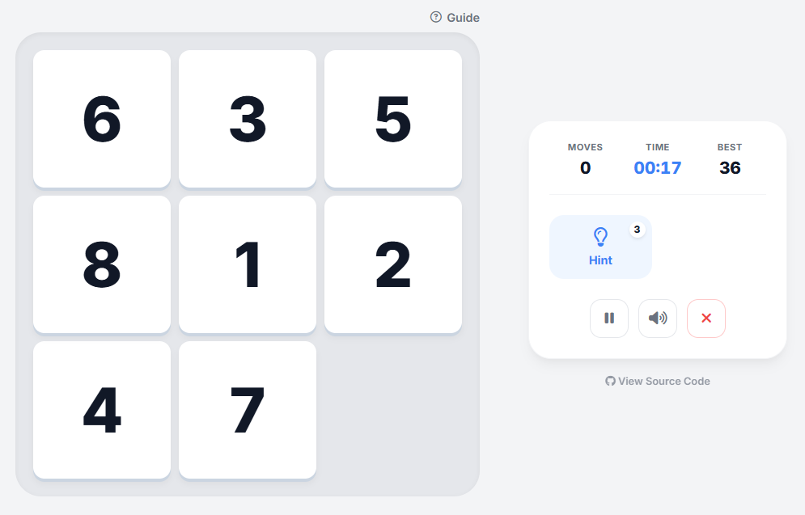

<h1 align="center">Mind Mosaic Game</h1>
<p align="center"><strong>Bring order to chaos.</strong></p>

<p align="center">
  <a href="https://github.com/ramazancetinkaya/mind-mosaic-game/issues">
    
  </a>
  <a href="https://github.com/ramazancetinkaya/mind-mosaic-game/stargazers">
    
  </a>
  <a href="https://github.com/ramazancetinkaya/mind-mosaic-game/network">
    
  </a>
  
</p>

<p align="center">
  
  
  
</p>

<br />

<div align="center">

| Screenshot |
| :---: |
|  |

</div>

## Overview

Mind Mosaic is a browser-based implementation of the classic numerical sliding puzzle. The objective is to rearrange the scrambled tiles into numerical order by sliding them into the empty space, utilizing logic and spatial reasoning.

## Demo

View the live demo on GitHub Pages:

[](https://ramazancetinkaya.github.io/mind-mosaic-game/)

## Features

* **Adaptive Gameplay:** Seamlessly adjusts to both desktop and mobile interfaces.
* **Dynamic Difficulty:** Offers Easy (3x3), Medium (4x4), and Hard (5x5) grid modes.
* **Smart Hint System:** Provides navigational cues to guide players when stuck, featuring an anti-farming mechanic that rewards genuine progress.
* **Magic Wand:** A unique ability available in higher difficulties that instantly solves a single tile while mathematically maintaining the puzzle's solvability.
* **Immersive Feedback:** Features procedural audio effects and tactile visual responses for every interaction.
* **State Persistence:** Automatically saves high scores and preferences locally.

## How to Play

1.  **Objective:** Order the numbered tiles sequentially (1 to 15) from left to right, top to bottom.
2.  **Movement:** Click, tap, or use arrow keys to slide a tile into the adjacent empty space.
3.  **Assistance:**
    * Use the **Hint** button to see the next logical move.
    * Use the **Magic Wand** (limited use) to auto-correct a specific tile.
4.  **Winning:** The game ends when all tiles are in their correct numerical positions.

## Installation and Usage

### Option 1: Git Clone

If you have Git installed, use the following command to clone the repository:

```bash
git clone https://github.com/ramazancetinkaya/mind-mosaic-game.git
```

Navigate to the project directory:

```bash
cd mind-mosaic-game
```

Open `index.html` in your web browser to use the application.

### Option 2: ZIP Download

1. Visit the repository at `https://github.com/ramazancetinkaya/mind-mosaic-game`
2. Click the "Code" button
3. Select "Download ZIP" from the dropdown menu
4. Extract the ZIP file to your preferred location
5. Open the extracted folder
6. Open `index.html` in your web browser to use the application

## License and Legal Notice

**Copyright (c) 2025 Ramazan Çetinkaya**

This software is provided for **Educational Use Only**.

* **Permitted:** You may view, download, and modify the source code locally for personal learning and experimentation.
* **Prohibited:** Unauthorized commercial distribution, monetization, claiming ownership, or uploading this software to public app stores or hosting platforms is strictly prohibited.

By accessing this repository, you agree to these terms.
